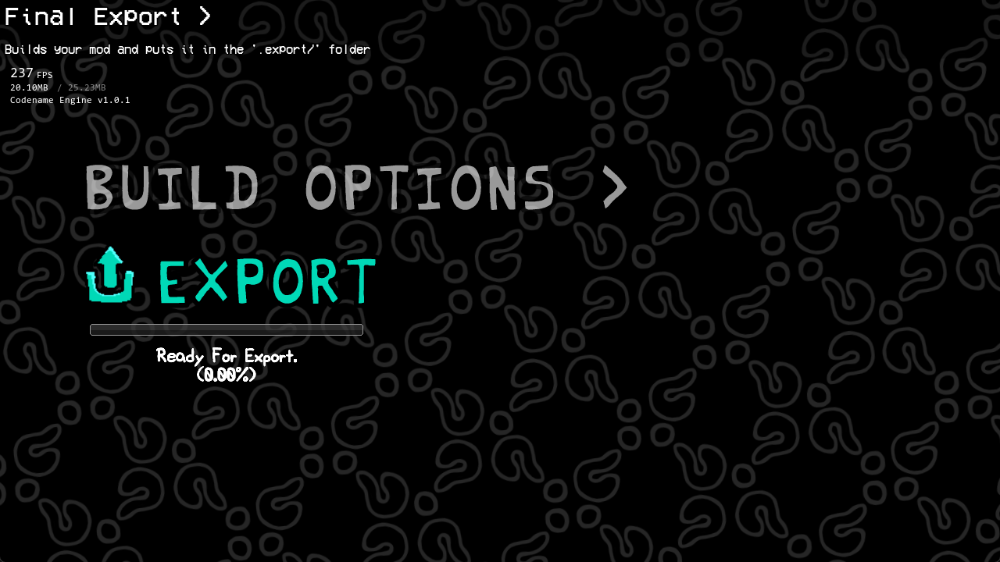
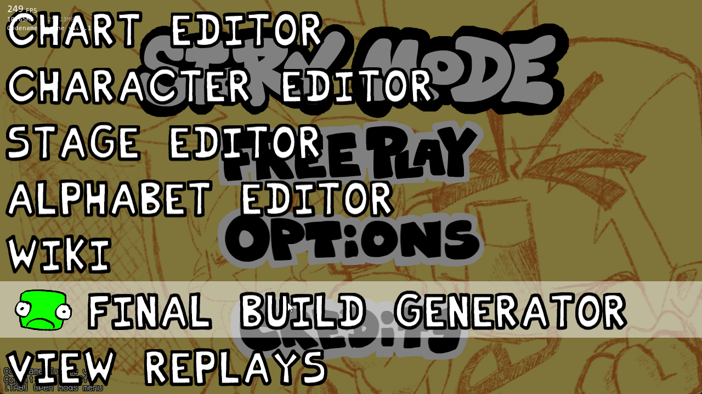

# Codename Engine - Final Build Exporter Addon
This is all softcoded, and uses threading so if your mod doesn't include the <u>`ALLOW_MULTITHREADING`</u> in the Project.xml then you are unable to use this addon.

**If your using CodenameEngine from releases or Experimentals** this doesn't apply to you.
<div style="display: flex; justify-content: center; gap: 25px;">



</div>

### Consider Donating to me!
I work on some Addons / Projects alone, and I don't get paid for any of it.
<br>I'm also in a financial hardship, anything helps ❤️

[](https://ko-fi.com/X8X4PZBTA)

## How to use
Download the latest release (or an older release if needed) and place this in your `./addons/` folder relative to your Executable of your CodenameEngine (`./` is relative pathing btw)

Then all you need to do is be able to access the `EditorPicker` (pressing 7 opens this if you don't override the `MainMenuState.hx` in your mod) and You will see `Final Build Generator`, clicking on this will bring you to the exporting area.
<div style="display: flex; justify-content: center; gap: 25px;">



</div>

If you need to access this state in a custom state, you can add this code:
```haxe
import funkin.editors.EditorTreeMenu;

function update(elapsed:Float) {
    if (controls.DEV_ACCESS) {
        persistentUpdate = false;
        persistentDraw = true;
        openSubState(new EditorPicker());
    }
}
```
This will mimic the code found in the default `MainMenuState.hx`.

## How to configure your mod to the fullest?
In the download of the Addon, if you look in `./data/config/` you will see a `build_ignore.ini.example` file, this will have an example of the basics of what you can do.

You would put this in your own mod's folder in `./mods/[YOUR MOD]/data/config/build_ignore.ini`
#### This file is not exported in the final build your welcome !!
```ini
; Making a group with the prefix of `./` will be identified as a folder
; so you can add only these 2 values in the group. By default `KEEP_FOLDER` is true.
[./data/]
KEEP_FOLDER=true
REMOVE=test.txt,test2.txt, array_item 3.extension

; The values here are default values you can set, but you can change the values during export.
[Settings]
; If true, it will compress the mod into a .zip file.
COMPRESS=true
; If true, it will export the mod as a CodenameEngine Mod (if COMPRESS is true).
CNE_MOD=true
; If true, it will export the mod as an executable along side your Modpack export.
EXE_BUILD=false
```

So if you want to remove a folder in `./images/game/SUPER SECRET FOLDER/`, you'd do this:
```ini
[./images/game/SUPER SECRET FOLDER/]
KEEP_FOLDER=false
```

If you just want to remove specific files from the folder, you'd use the `REMOVE` data.
```ini
[./images/game/SUPER SECRET FOLDER/]
; KEEP_FOLDER=true ; Optional, since it's true by default.
REMOVE=my secret file.txt, another file2.png
```

## Where does my builds go?
All builds will be exported into `./.exports`, and everytime you rebuild it will clear the folder.
<div style="display: flex; justify-content: center; gap: 25px;">


</div>

## Currently Tested versions (and recommended)
- Experimental Commits:
  - **bbb16f4**